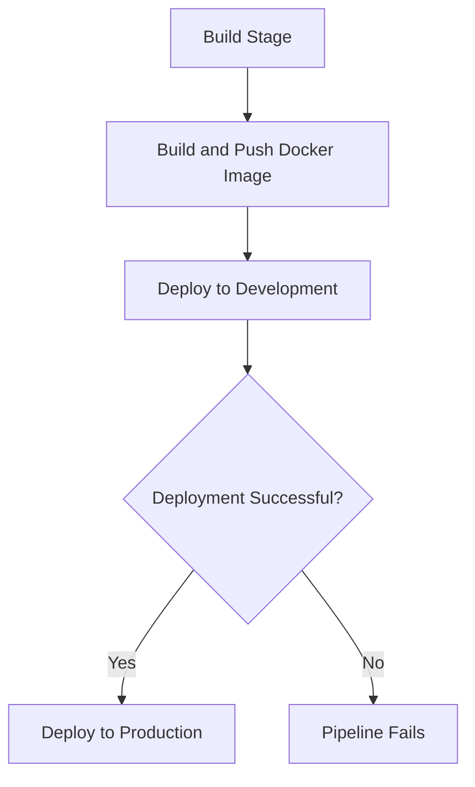

# Container Deployment Pipeline

This folder contains Azure DevOps pipeline templates and configurations for deploying containerized applications to virtual machines.

## Files

### deploy-container-job.yml

A reusable job template for deploying Docker containers to virtual machines. This template handles:

- Logging into the container registry
- Stopping and removing existing containers
- Cleaning up old images
- Pulling the latest image
- Running the new container
- Performing health checks to ensure the application is running correctly

#### Parameters

| Parameter | Description |
|-----------|-------------|
| containerName | Name of the container to deploy |
| containerRegistry | URL of the container registry (e.g., example.azurecr.io) |
| containerTag | Tag of the container image to deploy |
| containerPort | Port that the application exposes inside the container |
| containerHostPort | Port to expose on the host machine |
| registryServiceConnection | Service connection ID for the container registry |
| environment | Name of the deployment environment |
| environmentVM | Name of the virtual machine resource |

### pipeline-deploy-container.yml

A complete pipeline definition for building and deploying containerized applications. This pipeline:

1. Builds and pushes a Docker image to Azure Container Registry
2. Deploys the container to a development environment
3. Deploys the container to a production environment (after successful deployment to development)

#### Pipeline Configuration

- **Trigger**: Automatically runs on changes to the `develop` branch and files in the `containerFolder` directory
- **Variables**: Configurable settings for container name, registry, ports, and environment details
- **Stages**:
  - **Build**: Builds and pushes the Docker image
  - **DeployToDev**: Deploys to the development environment
  - **DeployToProd**: Deploys to the production environment

## Usage

1. Copy these files to your Azure DevOps repository
2. Customize the variables in `pipeline-deploy-container.yml` to match your project requirements
3. Set up the necessary service connections in your Azure DevOps project
4. Configure your deployment environments and virtual machines
5. Reference this pipeline in your Azure DevOps project

## Diagram

## Notes

- The health check in `deploy-container-job.yml` can be customized to match your application's health endpoint
- The pipeline assumes you have already set up the necessary Azure DevOps environments and resources
- For security reasons, service connection IDs are placeholders and should be replaced with your actual IDs
