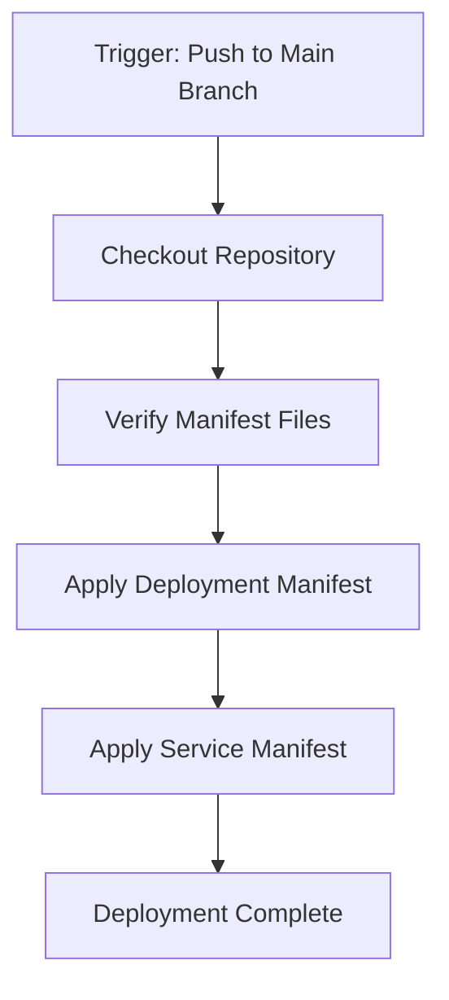

# Kubernetes Deployment Pipeline

This folder contains Azure DevOps pipeline configurations for deploying applications to Kubernetes clusters, specifically Amazon EKS (Elastic Kubernetes Service).

## Files

### pipeline-deploy-kubernetes.yml

A pipeline definition for deploying applications to Kubernetes clusters. This pipeline:

1. Checks out the repository code
2. Verifies the existence of Kubernetes manifest files
3. Applies the Kubernetes manifests to deploy the application and its service

#### Pipeline Configuration

- **Trigger**: Automatically runs on changes to the `main` branch
- **Agent**: Uses the `ubuntu-latest` virtual machine image
- **Environment**: Deploys to the `development` environment and the `default` namespace
- **Steps**:
  - Checkout the repository
  - Verify manifest files exist
  - Apply the application deployment manifest
  - Apply the service manifest

## Required Manifest Files

The pipeline expects the following Kubernetes manifest files to exist in your repository:

- `$(Build.SourcesDirectory)/manifests/webapp-hello-v1.yml`: Deployment manifest for the application
- `$(Build.SourcesDirectory)/manifests/webapp-hello-service-v1.yml`: Service manifest for the application

## Usage

1. Copy this file to your Azure DevOps repository
2. Create the necessary Kubernetes manifest files in a `manifests` directory
3. Set up the Kubernetes environment in your Azure DevOps project
4. Configure the Kubernetes service connection
5. Reference this pipeline in your Azure DevOps project

## Diagram

## Notes

- This pipeline assumes you have already set up the necessary Azure DevOps environments and Kubernetes service connections
- The pipeline is configured to deploy to the `default` namespace in the Kubernetes cluster
- You may need to customize the manifest file paths based on your repository structure
- For more complex deployments, consider adding additional steps such as:
  - Running tests before deployment
  - Performing database migrations
  - Implementing canary or blue-green deployment strategies
  - Adding post-deployment validation steps
