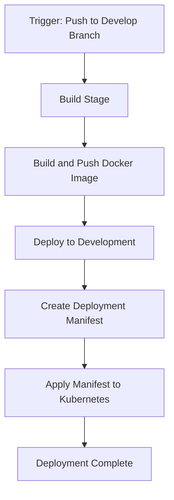

# ☸️ On-Premises Kubernetes Deployment Pipeline

This folder contains Azure DevOps pipeline configurations for deploying containerized applications to on-premises Kubernetes clusters.

## 📄 Files

### 🔄 pipeline-deploy-kubernetes.yml

A pipeline definition for building Docker images and deploying them to on-premises Kubernetes clusters. This pipeline:

1. Builds and pushes a Docker image to Azure Container Registry
2. Creates a Kubernetes deployment manifest dynamically
3. Applies the manifest to deploy the application to the Kubernetes cluster

#### ⚙️ Pipeline Configuration

- **🔄 Trigger**: Automatically runs on changes to the `develop` branch and files in the `frontend` directory
- **🖥️ Agent**: Uses the `ubuntu-latest` virtual machine image
- **🔧 Variables**: Configurable settings for container name, registry, ports, and environment details
- **📦 Stages**:
  - **🏗️ Build**: Builds and pushes the Docker image to Azure Container Registry
  - **🚀 DeployToDev**: Deploys the application to the development environment's Kubernetes cluster

## 🔐 Prerequisites

Before using this pipeline, you must:

1. Create a Kubernetes secret to connect to Azure Container Registry (ACR)
2. Configure the secret name in the deployment manifest (`secret-name-of-kubernetes`)
3. Set up the necessary service connections in your Azure DevOps project

## 📝 Usage

1. Copy this file to your Azure DevOps repository
2. Customize the variables in `pipeline-deploy-kubernetes.yml` to match your project requirements
3. Set up the necessary service connections in your Azure DevOps project
4. Configure your deployment environments and virtual machines
5. Create the required Kubernetes secret for ACR authentication
6. Reference this pipeline in your Azure DevOps project

## 📊 Diagram

## 📌 Notes

- This pipeline dynamically generates the Kubernetes deployment manifest during runtime
- The deployment is configured with resource limits (CPU and memory) for better cluster resource management
- The pipeline uses image pull secrets to authenticate with Azure Container Registry
- For production deployments, consider adding additional stages and approval gates
- The deployment is configured with 5 replicas for high availability
