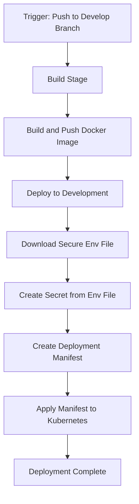

# 📚 Azure DevOps Library-Based Kubernetes Deployment Pipeline

This folder contains Azure DevOps pipeline configurations for deploying containerized applications to Kubernetes clusters using the Azure DevOps Library. The pipeline demonstrates how to securely manage and deploy environment variables by leveraging secure files stored in the Azure DevOps Library.

## 📄 Files

### 🔄 pipeline-deploy-with-library.yml

A pipeline definition for building Docker images and deploying them to Kubernetes clusters using environment variables from a secure file stored in the Azure DevOps Library. This pipeline:

1. Builds and pushes a Docker image to Azure Container Registry
2. Downloads and deploys environment variables as Kubernetes secrets
3. Creates a Kubernetes deployment manifest dynamically
4. Applies the manifest to deploy the application to the Kubernetes cluster

#### ⚙️ Pipeline Configuration

- **🔄 Trigger**: Automatically runs on changes to the `develop` branch and files in the `frontend` directory
- **🖥️ Agent**: Uses the `ubuntu-latest` virtual machine image
- **🔧 Variables**: Configurable settings for container name, registry, ports, and environment details
- **📦 Stages**:
  - **🏗️ Build**: Builds and pushes the Docker image to Azure Container Registry
  - **🚀 DeployToDev**: Deploys the application to the development environment's Kubernetes cluster

## 🔐 Prerequisites

Before using this pipeline, you must:

1. Create a service principal on ACR.
   After you create your container registry, use the following command to create a service principal, so you can access your container registry from Kubernetes:
   Azure CLI
   ```
   az ad sp create-for-rbac
     --scopes /subscriptions/<SUBSCRIPTION_ID>/resourcegroups/<RG_NAME>/providers/Microsoft.ContainerRegistry/registries/<REGISTRY_NAME>
     --role Contributor
     --name <SERVICE_PRINCIPAL_NAME>
   ```

2. Create a Kubernetes secret to connect to Azure Container Registry (ACR)
   ```
   kubectl create secret docker-registry <secret-name> \
       --namespace <namespace> \
       --docker-server=<REGISTRY_NAME>.azurecr.io \
       --docker-username=<appId> \
       --docker-password=<password>
   ```

3. Configure the secret name in the deployment manifest (`secret-name-of-kubernetes`)

4. Create a secure file in the Azure DevOps Library named 'BackendEnv' containing the environment variables for your application. This is a key feature of this pipeline, as it securely stores sensitive configuration data.

5. Set up the necessary service connections in your Azure DevOps project

## 🔒 Azure DevOps Library Integration

This pipeline showcases the integration with Azure DevOps Library, which provides several benefits:

- **Secure Storage**: Environment variables and secrets are stored securely in the Azure DevOps Library
- **Access Control**: Library secure files can have specific security permissions
- **Environment Separation**: Different secure files can be used for different environments
- **No Secrets in Code**: Sensitive information is kept out of source control
- **Simplified Updates**: Environment variables can be updated without changing pipeline code

The pipeline uses the `DownloadSecureFile@1` task to retrieve the secure file during runtime and then creates a Kubernetes secret from its contents.

## 📝 Usage

1. Copy this file to your Azure DevOps repository
2. Customize the variables in `pipeline-deploy-with-library.yml` to match your project requirements
3. Set up the necessary service connections in your Azure DevOps project
4. Configure your deployment environments and virtual machines
5. Create the required Kubernetes secret for ACR authentication
6. Upload your environment variables file to the Azure DevOps Library as a secure file named 'BackendEnv' (Library → Secure files → + Secure file)
7. Reference this pipeline in your Azure DevOps project

## 📊 Diagram



## 📌 Notes

- This pipeline demonstrates a best practice for handling sensitive configuration by using the Azure DevOps Library
- The environment variables are deployed as a Kubernetes secret and mounted in the container
- The deployment is configured with 4 replicas for high availability
- The pipeline dynamically generates the Kubernetes deployment manifest during runtime
- The pipeline uses image pull secrets to authenticate with Azure Container Registry
- For production deployments, consider adding additional stages and approval gates

## 📚 References

- [Kubernetes equivalent of env file in Docker](https://stackoverflow.com/questions/33478555/kubernetes-equivalent-of-env-file-in-docker)
