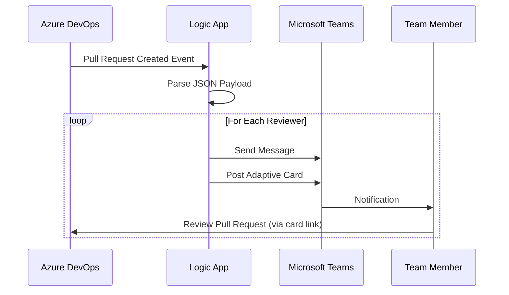

# Pull Request Notification System

This folder contains configuration files for automating pull request notifications to reviewers via Microsoft Teams using Azure Logic Apps.

## Files

### adaptive-card-teams.json

An Adaptive Card template for Microsoft Teams notifications. This template creates a rich, interactive card that displays:

- Pull request ID
- Repository name
- Pull request title
- Creator's name
- Whether review is required
- A "Review" button that links directly to the pull request

The Adaptive Card provides a visually appealing and informative notification that allows reviewers to quickly understand the pull request details and take action.

### azure-devops-pull-request-notification.json

An Azure Logic App workflow definition for processing pull request events from Azure DevOps and sending notifications to reviewers. This workflow:

1. Receives webhook events from Azure DevOps
2. Parses the JSON payload to extract pull request details
3. Iterates through each reviewer assigned to the pull request
4. Sends a message to each reviewer in Microsoft Teams
5. Posts an Adaptive Card to each reviewer in Microsoft Teams

## Setup Instructions

### Prerequisites

- An Azure subscription
- Access to Azure Logic Apps
- Microsoft Teams
- Azure DevOps project with pull request workflows

### Implementation Steps

1. **Create an Azure Logic App**:
   - Create a new Logic App in the Azure Portal
   - Import the `azure-devops-pull-request-notification.json` definition

2. **Configure Teams Connection**:
   - Set up a Teams connection in the Logic App
   - Update the connection ID in the workflow definition

3. **Set up Azure DevOps Webhook**:
   - Go to your Azure DevOps project settings
   - Navigate to Service Hooks
   - Create a new webhook that triggers on pull request created events
   - Point the webhook URL to your Logic App's HTTP trigger endpoint

## Diagram

## Customization

You can customize the notification content and appearance by modifying:

- The Adaptive Card template in `adaptive-card-teams.json`
- The message text in the Logic App workflow
- The workflow logic to add additional conditions or actions

## Notes

- The Logic App uses the Teams connection to send messages and cards to reviewers
- Reviewers are identified by their unique names in Azure DevOps
- The workflow can be extended to handle other pull request events such as updates or completions
- For security reasons, connection IDs in the workflow definition are placeholders and should be replaced with your actual IDs
